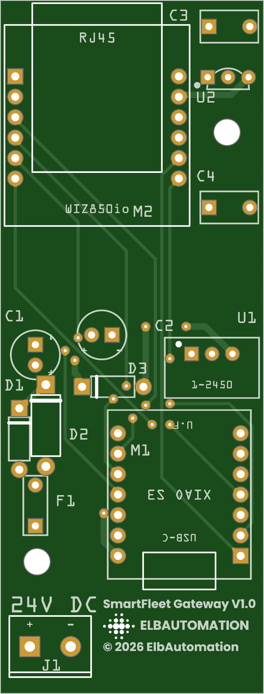

# SmartFleet Gateway

Mehr zu SmartFleet: <https://smartfleetmanager.de> · Handbuch:
<https://smartfleetmanager.de/docs/>

Das SmartFleet Gateway ist ein Hutschienengerät mit 2 TE für den
Schaltschrank. Es verbindet einen Loxone Miniserver vor Ort mit dem
SmartFleet-Server des Loxone-Partners: Einrichtung über ein eigenes WLAN,
danach Kopplung und Datenaustausch über LAN oder WLAN.

*English: DIN-rail gateway (2 modules) that connects a Loxone Miniserver to a
SmartFleet server. This repository holds the firmware image and the carrier
board (Fritzing project, schematic, Gerber files, bill of materials and build
guide, in German).*



## Inhalt

| Ordner | Was |
|---|---|
| `firmware/` | Firmware-Image für den XIAO ESP32S3 Plus auf der Trägerplatine |
| `hardware/` | Trägerplatine V1.0: Bauanleitung mit Stückliste, Fritzing-Projekt, Schaltplan, Gerber-Dateien, Bohrschablone |

## Hardware

- **ESP:** Seeed Studio XIAO ESP32S3 Plus (16 MB Flash, 8 MB PSRAM, U.FL)
- **LAN:** WIZnet WIZ850io (W5500 mit RJ45)
- **Versorgung:** 24 V DC (12–28 V), Verpolschutz, Sicherung, Überspannungsschutz
- **WLAN:** externe Stabantenne über RP-SMA-Buchse
- **Gehäuse:** Camdenboss CNMB/2, 2 TE, nach DIN 43880
- Nur Durchsteckbauteile und fertige Module, kein SMD-Löten

24 V kommen unten links an, das Netzwerkkabel oben links, die Antenne sitzt
oben rechts.

| Datei | Inhalt |
|---|---|
| [`hardware/BAUANLEITUNG.md`](hardware/BAUANLEITUNG.md) | Aufbau Schritt für Schritt, Prüfung, Gehäusebearbeitung, Stückliste |
| `hardware/stueckliste.csv` | Stückliste mit Reichelt-Links (Semikolon, UTF-8) |
| `hardware/schaltplan.pdf` | Schaltplan |
| `hardware/traegerplatine.fzz` | Fritzing-Projekt (Platine, Schaltplan, Steckbrett) |
| `hardware/traegerplatine_gerber.zip` | Fertigungsdaten für den Leiterplattenhersteller (2 Lagen, 1,6 mm) |
| `hardware/gerber/` | dieselben Gerber-Dateien einzeln |
| `hardware/bilder/` | Ansicht der Platine aus den Gerber-Dateien |
| `hardware/bohrschablone.pdf` | Schablone für Gehäuse und Klemmenabdeckung, 1:1 drucken |
| `hardware/steckbrettplan.png` | Aufbau als Prototyp auf dem Steckbrett |

**Stand:** Entwurf V1.0. Die Maße stammen aus den Datenblättern; die Anprobe
mit den echten Teilen steht noch aus. Vor dem Bestellen der Platine und vor
dem Schneiden am Gehäuse die Hinweise in der Bauanleitung beachten.

## Firmware

`firmware/smartfleet-gateway-0.1.0-xiao-esp32s3.bin` ist ein vollständiges Image (Bootloader, Partitionstabelle,
Anwendung) für den XIAO ESP32S3 Plus auf der Trägerplatine, Version 0.1.0.
Es wird ab Adresse `0x0` geschrieben.

**Im Browser** (Chrome oder Edge): <https://espressif.github.io/esptool-js/>
öffnen, *Connect* wählen, den XIAO auswählen, Adresse `0x0` und die Datei
angeben, *Program*.

**Mit esptool:**

```sh
esptool.py --chip esp32s3 write_flash 0x0 smartfleet-gateway-0.1.0-xiao-esp32s3.bin
```

Erkennt der Rechner den XIAO nicht: BOOT-Taster halten, USB-C einstecken,
loslassen. Über USB allein hat das WIZ850io keinen Strom — LAN geht erst mit
24 V an der Klemme.

Nach dem Aufspielen erscheint das Einrichtungs-WLAN `SmartFleet-XXXX`; weiter
im Handbuch. Weitere Versionen spielt das Gerät über das Netz ein; es nimmt
nur signierte Images an.

**Stand:** Die Firmware läuft auf einem ESP32-S3-Testboard. Auf der
Trägerplatine ist sie noch nicht geprüft.

## Pinbelegung XIAO ↔ WIZ850io

| Signal | XIAO | GPIO |
|---|---|---|
| CS | D10 | 9 |
| SCK | D9 | 8 |
| MOSI | D8 | 7 |
| MISO | D1 | 2 |
| RST | D0 | 1 |
| INT | D3 | 4 |
| Taster | BOOT | 0 |
| LED | — | 21 |

---

© 2026 ElbAutomation
